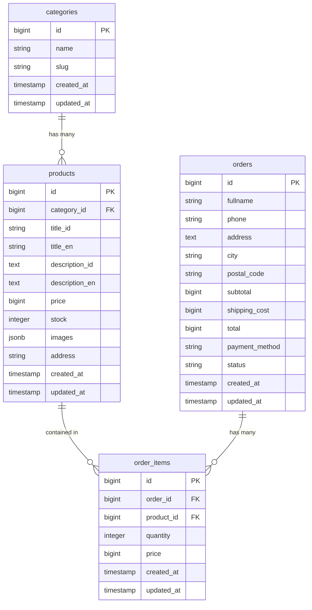

# Database Schema Specification

Dokumen ini mendefinisikan rancangan skema database PostgreSQL untuk aplikasi e-commerce **MineCart**. Basis data ini akan dikelola menggunakan Laravel Migrations dan diakses melalui Eloquent ORM.

## 1. Diagram Hubungan Entitas (ERD)



---

## 2. Struktur Tabel & Migrasi

### A. Tabel `categories`
Menyimpan data kategori produk (misalnya: Pakaian, Elektronik, Buku).

| Nama Kolom | Tipe Data | Atribut | Deskripsi |
| :--- | :--- | :--- | :--- |
| `id` | `BIGINT` | Primary Key, Auto Increment | Identifier unik kategori |
| `name` | `VARCHAR(100)`| Not Null | Nama kategori |
| `slug` | `VARCHAR(100)`| Not Null, Unique | Slug kategori untuk URL ramah SEO |
| `created_at` | `TIMESTAMP` | Nullable | Tanggal data dibuat |
| `updated_at` | `TIMESTAMP` | Nullable | Tanggal data diperbarui |

*Definisi Migrasi Laravel:*
```php
Schema::create('categories', function (Blueprint $table) {
    $table->id();
    $table->string('name', 100);
    $table->string('slug', 100)->unique();
    $table->timestamps();
});
```

---

### B. Tabel `products`
Menyimpan data katalog produk. Judul dan deskripsi dipisahkan untuk mendukung dwi-bahasa (ID/EN).

| Nama Kolom | Tipe Data | Atribut | Deskripsi |
| :--- | :--- | :--- | :--- |
| `id` | `BIGINT` | Primary Key, Auto Increment | Identifier unik produk |
| `category_id`| `BIGINT` | Foreign Key | Relasi ke `categories.id` (set null on delete) |
| `title_id` | `VARCHAR(255)`| Not Null | Judul produk versi Bahasa Indonesia |
| `title_en` | `VARCHAR(255)`| Not Null | Judul produk versi Bahasa Inggris |
| `description_id` | `TEXT` | Not Null | Deskripsi produk versi Bahasa Indonesia |
| `description_en` | `TEXT` | Not Null | Deskripsi produk versi Bahasa Inggris |
| `price` | `BIGINT` | Not Null | Harga produk dalam Rupiah |
| `stock` | `INTEGER` | Not Null, Default: 0 | Jumlah stok barang tersedia |
| `images` | `JSONB` | Not Null | Array URL/path gambar produk |
| `address` | `VARCHAR(255)`| Not Null | Alamat/Kota asal produk untuk ongkir |
| `created_at` | `TIMESTAMP` | Nullable | Tanggal data dibuat |
| `updated_at` | `TIMESTAMP` | Nullable | Tanggal data diperbarui |

*Definisi Migrasi Laravel:*
```php
Schema::create('products', function (Blueprint $table) {
    $table->id();
    $table->foreignId('category_id')->nullable()->constrained()->onDelete('set null');
    $table->string('title_id');
    $table->string('title_en');
    $table->text('description_id');
    $table->text('description_en');
    $table->bigInteger('price');
    $table->integer('stock')->default(0);
    $table->json('images'); // Menyimpan array url gambar
    $table->string('address'); // Asal kota produk
    $table->timestamps();
    
    // Index untuk mempercepat pencarian produk
    $table->index(['title_id', 'title_en']);
});
```

---

### C. Tabel `orders`
Menyimpan ringkasan transaksi pesanan setelah checkout sukses.

| Nama Kolom | Tipe Data | Atribut | Deskripsi |
| :--- | :--- | :--- | :--- |
| `id` | `BIGINT` | Primary Key, Auto Increment | Identifier unik pesanan |
| `order_number` | `VARCHAR(255)`| Not Null, Unique | Nomor pesanan unik (MCT-...) |
| `fullname` | `VARCHAR(150)`| Not Null | Nama lengkap penerima |
| `phone` | `VARCHAR(20)` | Not Null | Nomor telepon penerima |
| `address` | `TEXT` | Not Null | Alamat pengiriman lengkap |
| `city` | `VARCHAR(100)`| Not Null | Kota tujuan pengiriman |
| `postal_code`| `VARCHAR(10)` | Not Null | Kode pos pengiriman |
| `courier_note`| `TEXT` | Nullable | Catatan untuk kurir pengiriman |
| `subtotal` | `BIGINT` | Not Null | Total harga semua item sebelum ongkir |
| `shipping_cost`| `BIGINT` | Not Null | Ongkos kirim yang dihitung |
| `total` | `BIGINT` | Not Null | Total biaya transaksi (subtotal + ongkir) |
| `payment_method`| `VARCHAR(50)`| Not Null | Metode pembayaran (Transfer, COD, dll.) |
| `payment_status`| `VARCHAR(50)`| Not Null, Default: 'paid' | Status pembayaran |
| `status` | `VARCHAR(30)` | Not Null, Default: 'processing'| Status pesanan (processing, dll) |
| `created_at` | `TIMESTAMP` | Nullable | Tanggal transaksi dibuat |
| `updated_at` | `TIMESTAMP` | Nullable | Tanggal transaksi diperbarui |

*Definisi Migrasi Laravel:*
```php
Schema::create('orders', function (Blueprint $table) {
    $table->id();
    $table->string('order_number')->unique();
    $table->string('fullname');
    $table->string('phone');
    $table->text('address');
    $table->string('city');
    $table->string('postal_code', 10);
    $table->text('courier_note')->nullable();
    $table->bigInteger('subtotal');
    $table->bigInteger('shipping_cost');
    $table->bigInteger('total');
    $table->string('payment_method');
    $table->string('payment_status')->default('paid');
    $table->string('status')->default('processing');
    $table->timestamps();
});
```

---

### D. Tabel `order_items`
Menyimpan rincian produk yang dibeli di setiap transaksi sebagai "snapshot" agar harga historis tidak berubah bila harga produk diperbarui di masa depan.

| Nama Kolom | Tipe Data | Atribut | Deskripsi |
| :--- | :--- | :--- | :--- |
| `id` | `BIGINT` | Primary Key, Auto Increment | Identifier unik detail item |
| `order_id` | `BIGINT` | Foreign Key | Relasi ke `orders.id` (cascade on delete) |
| `product_id` | `BIGINT` | Foreign Key | Relasi ke `products.id` (set null on delete) |
| `product_name` | `VARCHAR(255)`| Not Null | Nama produk saat transaksi (snapshot) |
| `price` | `BIGINT` | Not Null | Harga satuan produk pada saat transaksi (snapshot) |
| `quantity` | `INTEGER` | Not Null | Jumlah barang yang dibeli |
| `subtotal` | `BIGINT` | Not Null | Subtotal per item (price * quantity) |
| `created_at` | `TIMESTAMP` | Nullable | Tanggal data dibuat |
| `updated_at` | `TIMESTAMP` | Nullable | Tanggal data diperbarui |

*Definisi Migrasi Laravel:*
```php
Schema::create('order_items', function (Blueprint $table) {
    $table->id();
    $table->foreignId('order_id')->constrained()->onDelete('cascade');
    $table->foreignId('product_id')->nullable()->constrained()->onDelete('set null');
    $table->string('product_name');
    $table->bigInteger('price');
    $table->integer('quantity');
    $table->bigInteger('subtotal');
    $table->timestamps();
});
```

---

## 3. Relasi Model Eloquent

### 1. Model `Category`
```php
class Category extends Model {
    public function products() {
        return $this->hasMany(Product::class);
    }
}
```

### 2. Model `Product`
```php
class Product extends Model {
    protected $casts = [
        'images' => 'array',
    ];

    public function category() {
        return $this->belongsTo(Category::class);
    }
    
    public function orderItems() {
        return $this->hasMany(OrderItem::class);
    }
}
```

### 3. Model `Order`
```php
class Order extends Model {
    public function items() {
        return $this->hasMany(OrderItem::class);
    }
}
```

### 4. Model `OrderItem`
```php
class OrderItem extends Model {
    public function order() {
        return $this->belongsTo(Order::class);
    }

    public function product() {
        return $this->belongsTo(Product::class);
    }
}
```
